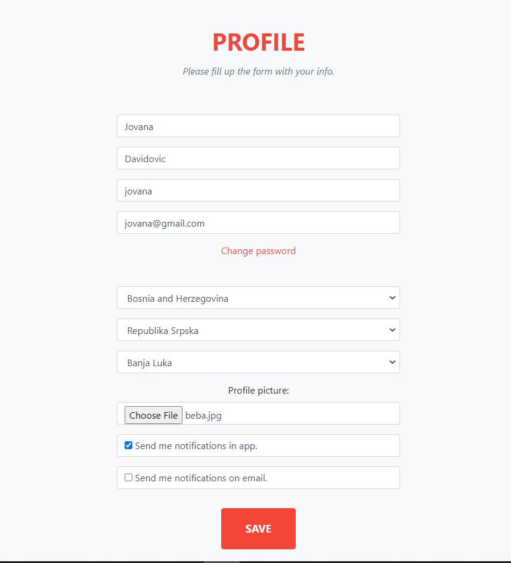
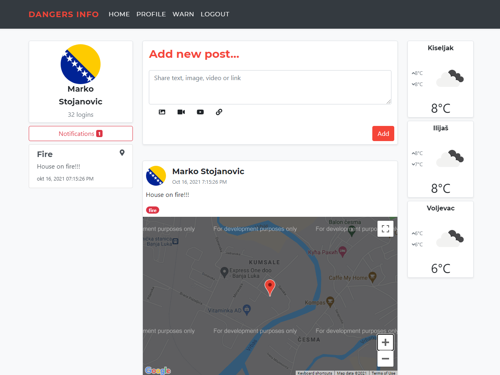
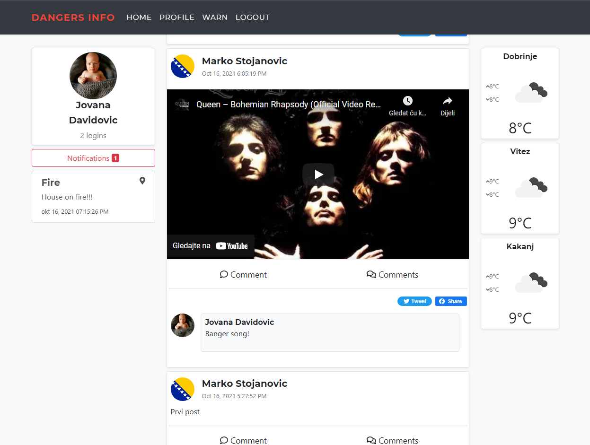
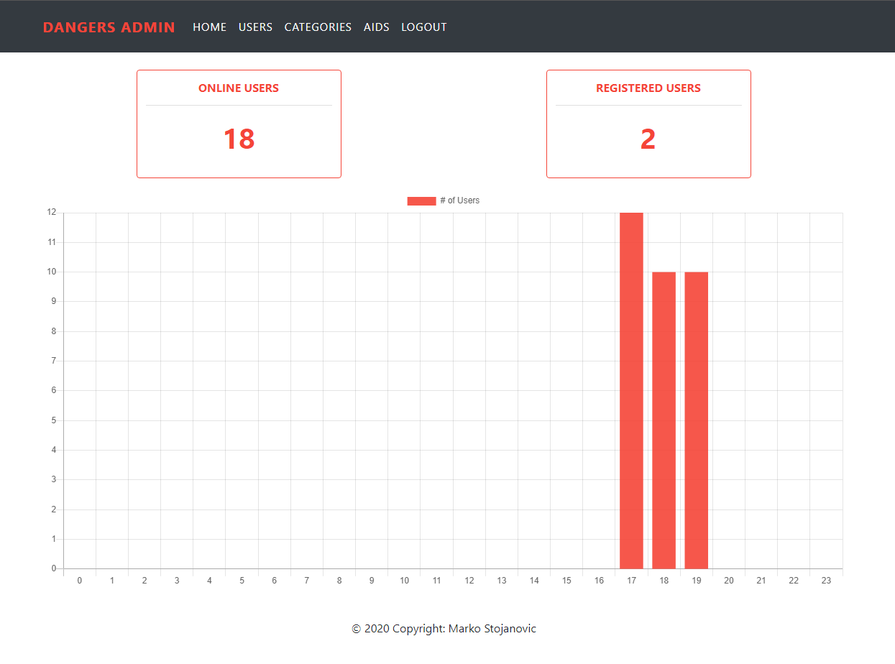

# Dangers

## Overview

***Dangers*** is system for easier posting and sharing informations about potential dangers. System consists of three applications:
- Main
- Admin
- Aid

### **Main apllication**

Main application is used by registered users who need to open a user account. Users register on the appropriate page where the name, username, password (2 times for verification) and e-mail address are entered. If the username is free and the mail has not already been used, the user successfully registers and is redirected to the profile page, where he needs to provide additional profile informations. On this page, in addition to basic information, you can select the country in which the user lives from the list of offered countries, select a profile picture and choose whether he wants to receive notifications of emergency alerts (within the application or by mail). The user can only be from some of the European countries that are filled by consuming the RESTful service available at https://restcountries.eu/rest/v3/region/europe. By using another RESTful service, based on the value of alpha2Code for the country, the regions of that country are automatically filled, and based on the region and cities, by consuming the appropriate services from http://battuta.medunes.net/. If  user does not select a profile picture to upload, the flag of the country in which he lives is assigned as a profile picture.

Users of the main application need to log in to the system to use it, and without logging in to the system the only pages available are the login page and the registration page.

After successful registration and login to the system, the user is shown a page on the left showing the user's name, avatar, how many times the user has logged in to the system, as well as a list of notifications of emergency alerts.

In the middle of the page should be a list of all posts related to potential hazards. Posts can be news or events obtained from the RSS feed https://europa.eu/newsroom/calendar.xml_en?field_nr_events_by_topic_tid=151, or posts by other users. Each user can post a link, text with pictures or video (own video or Youtube video). The avatar of the user who posted is displayed next to the post. All news is updated periodically (every 30 seconds). Posts can be shared on social networks (minimum Facebook and Twitter). Users can comment on the post, and can add a picture to the comment.

A registered user can enter a potential hazard announcement. Potential dangers can be understood as various things: a fallen tree on the road, a announced storm, flood, fire, etc. Potential hazards are added to a certain category when entering (provided that one post can be classified into several categories). Danger categories are added by the administrator. When entering, the user can choose to be an emergency alert, which is sent immediately after entry to all users who have selected this type of notification. When entering, it is optional for the user to add a Google maps location where the potential danger is located.

The right side of the screen shows the weather forecast for three randomly selected cities from the country where the user lives.

The data is stored in a MySQL database, and the application is implemented using the **JSP M2** model, **HTML5**, **JS**, and **AJAX**. The application is responsive and adapts to use on mobile devices.

Below are some screenshots.

### **Admin application**

This application should be used to monitor other parts of the system. Administrators are the only users of this application and must be logged on to the system in order to use it. The application on the home page shows the number of currently active users of the main application, the total number of registered users and a graph showing the number of users per hour in the previous 24 hours. In addition, the administrator can approve a user's registration, block any user, reset his password to a randomly selected value, view all posts from the help system, and delete any posts from that system. The system uses the same database as the main application, and is implemented using **JSF**. The chart is implemented using the **Chart.JS** library.

### **Aid application**

This system consists of a JSF application and a RESTful service. The web application is used to create a call to provide assistance to citizens in case of potential danger, which has a name, time location, description, image (URL) and category. The categories of calls for help are physical assistance in repairing the damage, collecting clothes, collecting basic foodstuffs, transportation and the like. Events are available as an RSS feed. Calls for assistance to other applications are available through the RESTful service. Calls are stored in the MySQL database, and all changes (blocking, false call registration) are available through the appropriate REST services.
